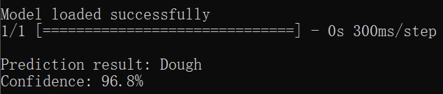
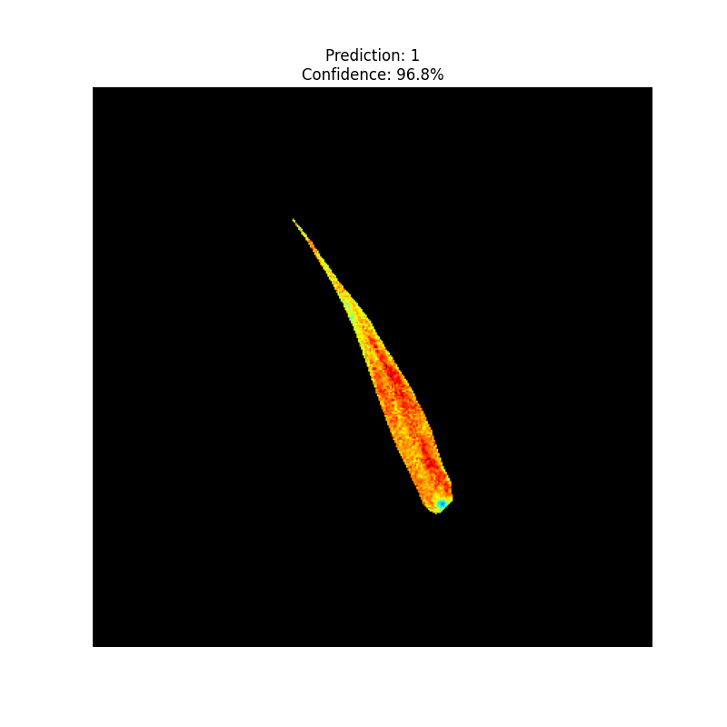
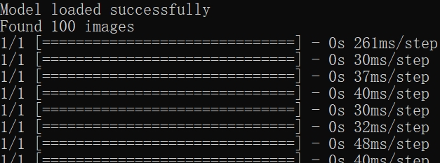
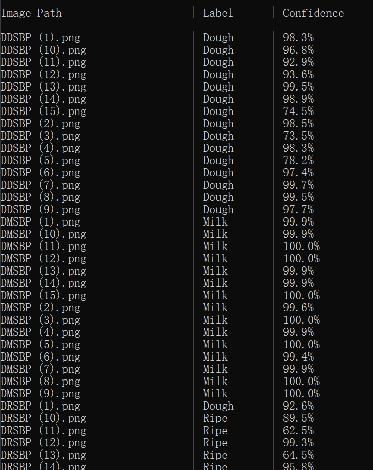
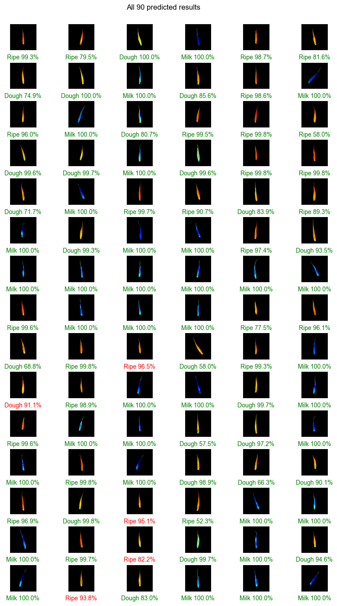

# Forage-seed-prediction
ResNet-18(or CNN) based deep learning model for rapid classification of forage seed with tiny difference.

## File Structure
```
your_repo/
├── model/                  # Pretrained models
├── training_sample/        # Training dataset
├── predicting_sample/      # Sample images for prediction
├── predict.py              # Prediction script
├── train.py                # Training script
├── evaluate.py             # Evaluation script
├── model_CNN.py 
└── model_resnet18.py       # Model architecture
```

## Environment Setup
Python 3.7.2 
```bash
# Install dependencies
pip install numpy pandas matplotlib seaborn scikit-learn tensorflow os shutil glob pathlib re pillow sys
```

## Quick Start
### Single Image Prediction
```bash
python predict_resnet18.py predicting_sample/Dough.png --show
```
Loading and Result：



Show：



### Batch Prediction
```bash
python predict_resnet18.py predicting_sample/
```
Loading：



Result：




## Model Training

Suitable for simulating training on personal computers, this case uses Intel (R) Core (TM) i7-14700HX 2.10 GHz CPU for testing

The image data used for simulating training is provided in training_Sample. zip

1. Prepare data:
```bash
unzip training_sample.zip -d ./training_sample
```

2. Start training:
```bash
python training_resnet18.py --data_dir ./training_sample
```

## Model Evaluation
```bash
python evaluate_resnet18.py
```
Output includes:
- 📊 Confusion Matrix: `./eval_results/confusion_matrix.png`
- 📈 ROC Curve: `./eval_results/roc_curve.png`
- ✅ Metrics: `./eval_results/metrics.txt`

Example of Prediction Results：



## Customization
### Training Parameters
Modify in `training_resnet18.py`:
```python
# Hyperparameters
EPOCHS = 30
BATCH_SIZE = 32
IMG_SIZE = 224  # Match image resizing
```

### Model Path
Update in `predict_resnet18.py`:
```python
model_path = './model/your_custom_model'  # Default: './model/pretrained_model'
```

## FAQ
❓ **Path errors**  
Use relative paths `./predicting_sample/` or absolute paths

❓ **Dependency conflicts**  
Recommend using virtual environment

❓ **Visualization issues**  
Ensure GUI support when using `--show` flag
